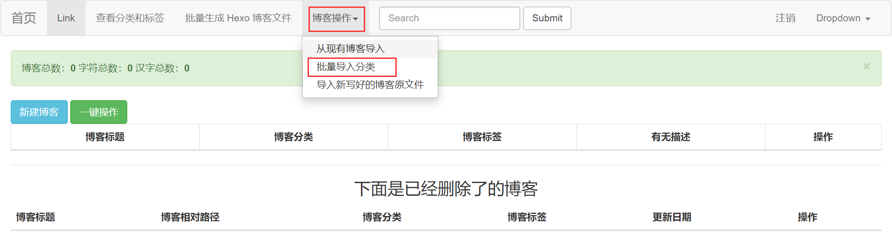
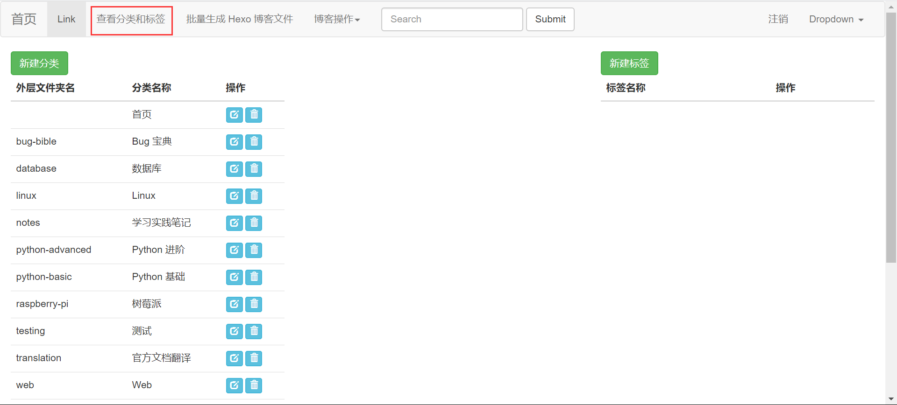
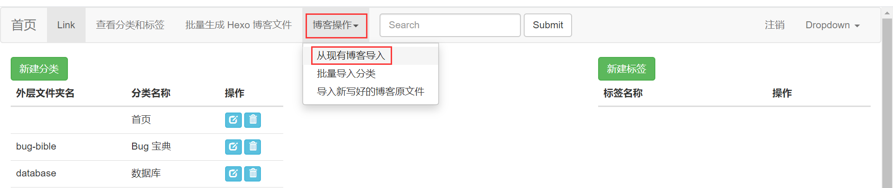
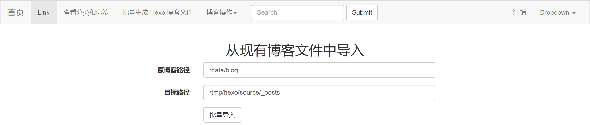
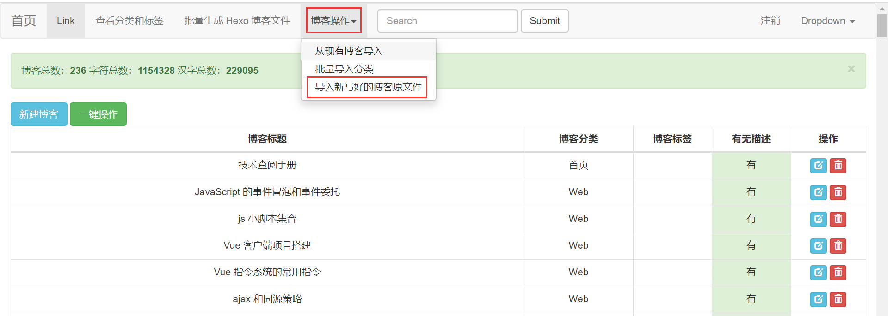
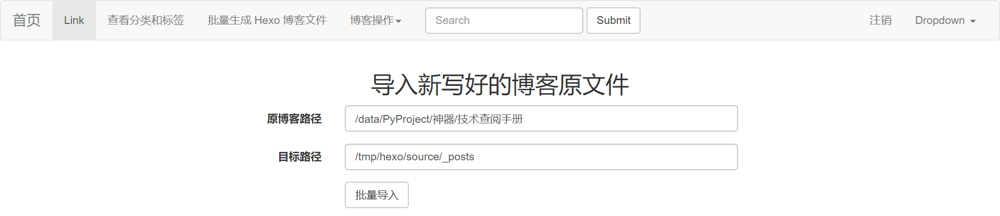

# Hexo Migrator 博客迁移工具

个人博客：https://sliu.vip

我的博客就是用这个工具，使用 Typera 写完之后，迁移成为 Hexo 友好型的博客。可以自动生成 Front Matter 头部，自动转换图片和站内链接。

## 项目背景

一直在用 Typeroa 写博客，写完之后想通过 Typery 发送图片。可每次都会


## 配置部署

### 项目下载

```
git clone 
```


### 安装依赖

开发使用 Python 版本：Python 3.6.8

有用到 f-strings，依赖 Python 3.6 以上版本。

如果需要，可以在虚拟环境中配置，就不多说了。

进入到**项目根目录**，运行命令安装依赖：

```bash
pip3 install -r requirements.txt
```

### 创建数据库

进入到 MySQL 数据库中，运行命令创建数据库：

```mysql
create database hexo default charset=utf8
```

### 数据库迁移

在此之前，需要修改项目设置中的 settings.py 文件数据库相关配置。找到下面的代码，修改成恰当的设置：

```python
DATABASES = {
    'default': {
        'ENGINE': 'django.db.backends.mysql',    # 使用 MySQL 数据库
        'NAME': 'hexo',    # 数据库名
        'HOST': '127.0.0.1',    # 数据库 IP
        'PORT': 3306,    # 数据库端口
        'USER': 'root',   # 登录数据库使用的用户名
        'PASSWORD': '123'    # 登录数据库使用的密码
    }
}
```

在项目根目录运行命令，迁移数据库：

```python
python3 manage.py makemigrations
python3 manage.py migrate
```

### 账号注册

没有写账号注册的功能，使用的是 django 自带的 admin 框架。创建账号通过命令：

```bash
python manage.py createsuperuser
```

有超级用户后，使用 admin 也可以实现用户的增加。

### 项目启动

在项目根路径普通启动 Django 项目的命令即可：

```python
python manage.py runserver    # 也可以指定 IP 端口，默认为 127.0.0.1:8000
```

## 基本使用

### 用户登录

浏览器访问 http://127.0.0.1:8000/login/ 进入登陆页面，使用刚刚注册好的账号即可登录。

### 分类和标签

在 settings.py 中，找到 CATEGORY_DICT 配置，键为最外层文件夹的内容，值为设置的对应的分类名。比如我写好的：

```python
# 外层文件夹和分类对应字典，批量导入分类时会用到
CATEGORY_DICT = {
    '': '首页',
    'bug-bible': 'Bug 宝典',
    'database': '数据库',
    'linux': 'Linux',
    'notes': '学习实践笔记',
    'python-advanced': 'Python 进阶',
    'python-basic': 'Python 基础',
    'raspberry-pi': '树莓派',
    'testing': '测试',
    'translation': '官方文档翻译',
    'web': 'Web',
    'django': 'Django',
    'project': '综合项目',
    'git': 'Git',
    'hexo': 'Hexo',
}
```

在 `settings.py` 中配置好以后，点击 `博客操作` 下的 `批量导入分类`，即可将设置中的分类信息导入到数据库中：



点击 `查看分类和标签`，即可对分类和标签进行管理：



### 博客管理

#### 已有博客批量导入

将已经生成了的 Hexo 博客导入到数据库中。若是第一次使用 Hexo，未生成过 Hexo 博客，没有将其导入数据库的需求，可忽略此功能。

需要注意的是，导入的博客信息将会覆盖数据库中已有的信息。

点击 `博客操作` 下的 `从现有博客导入`：



输入原博客位置和目标博客位置，点击 `批量导入` 即可：



原博客路径默认为 settings.py 中的 DEFAULT_OLD_DIR，目标路径默认为 settings.py 中的 BLOG_GEN_DIR。可以把这两个文件夹修改成你需要的，从而减少操作量：

```python
BLOG_GEN_DIR = r'/tmp/hexo/source/_posts'    # 生成的博客路径
DEFAULT_OLD_DIR = r'/data/blog'    # 要导入的旧的已经生成好的博客路径
```

#### 博客原文导入

使用 Typera 新写好的博客文件，有些地方并不符合 Hexo 格式要求。使用原文导入，会将这些不符合要求的语句转换为更规范的格式。这样，使用 Hexo 生成静态文件的时候才不会报错。

点击 `博客操作` 下的 `导入新写好的博客原文件`：



在 `原博客路径` 中输入博客原文件的最外层目录，在 `目标路径` 中输入要导出到的路径，点击 `批量导入` 即可：



